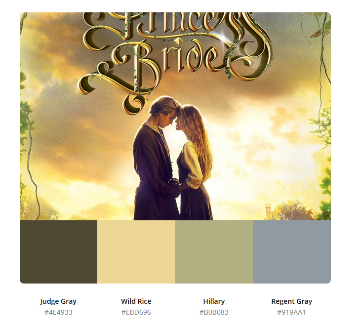

# Basemaps Example 1

What if VisitPGH asked for a map of locations for their local farmer's markets?

Requirements for the basemap: must use colors of the main sponsor, Karken Brewing; must be legible and clear.

I created a customized basemap using ArcGIS Developer editor using the Hex color codes of the sponsor's style guide. Then, I added an additional layer in ArcGIS online of location markers for the neighborhood farmer's markets.

Check it out: this map is interactive! Draw on the map to see more of the area; zoom in an out using your fingers or mouse; press on a location marker to see more information about the farmer's market.

<iframe width="500" height="400" frameborder="0" scrolling="no" marginheight="0" marginwidth="0" title="VisitPGH Example Map" src="//carnegiemellon.maps.arcgis.com/apps/Embed/index.html?webmap=bfb71507aee641959144c86ac1cf452e&extent=-80.0786,40.3827,-79.8463,40.4984&zoom=true&previewImage=false&scale=false&search=true&searchextent=true&legend=true&disable_scroll=true&theme=light"></iframe>

# Basemaps Example 2

This time on my own, I created a customized basemap using my favorite movie: The Princess Bride.

Self Imposed requirements for the basemap: must use colors from the main promotional poster; must be legible and clear.

I pulled the Hex codes of the movie's promotional poster using Canva. Then, I used the Hex codes to create a customized basemap in ArcGIS Developer.

Compare the two images. Can you see where the color pallet was used for land, water, and labels?

