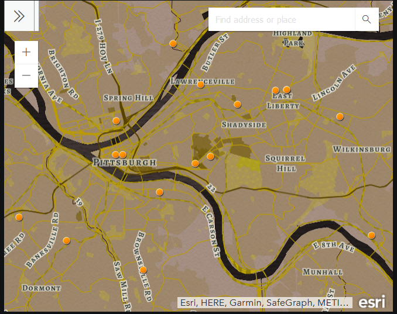
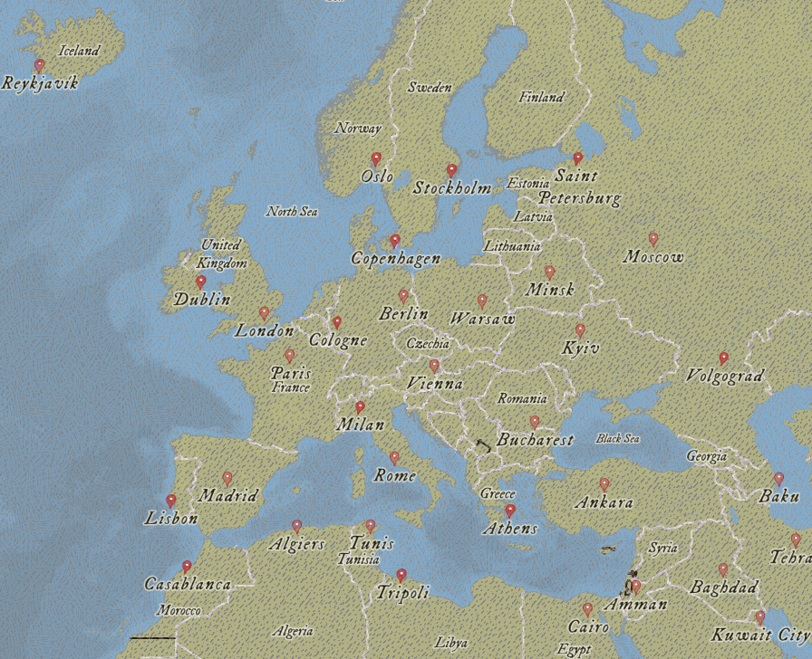
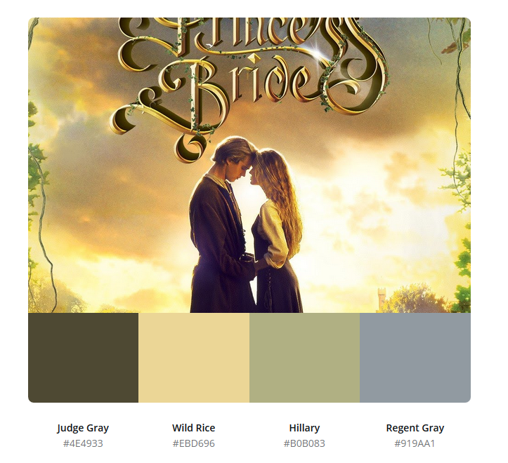

# Customized Basemaps
Basemaps are the first layer of a GIS map. These are examples of customized basemaps based on theme, color, or style guide.

---

## Basemaps Example 1: Visit PGH

Purpose statement: What if VisitPGH asked for a map of locations for their local farmer's markets?

Requirements for the basemap: Must use colors of the main sponsor, Karken Brewing; must be legible and clear.

Process: I created a customized basemap using ArcGIS Developer editor using the Hex color codes of the sponsor's style guide. Then, I added an additional layer in ArcGIS online of location markers for the neighborhood farmer's markets.

[**An interactive version of the map is available!**](/interactive_visitpgh.html)

---

## Basemaps Example 2: Princess Bride

Purpose statement: For practice, create a customized basemap based on my favorite movie: The Princess Bride.

Self Imposed requirements for the basemap: must use colors from the main promotional poster; must be legible and clear.

Process: I pulled the Hex codes of the movie's promotional poster using Canva. Then, I used the Hex codes to create a customized basemap in ArcGIS Developer.

Compare the two images. Can you see where the color pallet was used for land, water, and labels?

[Interactive version of the Princess Bride map can be found here on the Esri site.](https://carnegiemellon.maps.arcgis.com/home/webmap/viewer.html?webmap=3a1b2d9155484eefa88fd84dfb9af195&extent=-94.9219,-45.213,94.9219,45.213)
